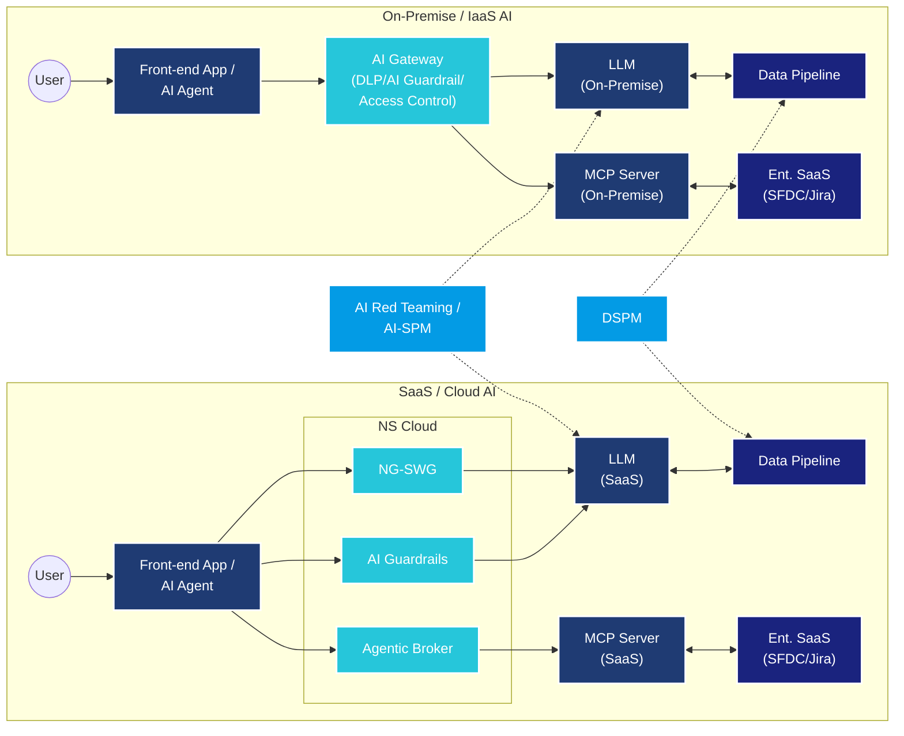

# Netskope AI Security Echo System

```mermaid
graph LR
    %% 스타일 정의
    classDef userApp fill:#1f3b73,stroke:#fff,stroke-width:2px,color:#fff;
    classDef nsCloud fill:#e0f2f1,stroke:#00acc1,stroke-width:2px,stroke-dasharray: 5 5;
    classDef nsComponents fill:#26c6da,stroke:#fff,stroke-width:2px,color:#fff;
    classDef saas fill:#1f3b73,stroke:#fff,stroke-width:2px,color:#fff;
    classDef pipeline fill:#1a237e,stroke:#fff,stroke-width:2px,color:#fff;
    classDef oob fill:#039be5,stroke:#fff,stroke-width:2px,color:#fff;

    %% 관리 영역 (Out of band)
    AIRT["AI Red Teaming /<br>AI-SPM"]:::oob
    DSPM["DSPM"]:::oob

    %% ----------------------------------------------------
    %% 상단 영역: SaaS / Cloud AI
    %% ----------------------------------------------------
    subgraph SaaS_Cloud_AI ["SaaS / Cloud AI"]
        direction LR
        
        U1((User)) --> FA1["Front-end App /<br>AI Agent"]:::userApp
        
        %% NS Cloud 영역 (별도 박스로 그룹화)
        subgraph NS_Cloud ["NS Cloud"]
            direction TB
            SWG["NG-SWG"]:::nsComponents
            AIG["AI Guardrails"]:::nsComponents
            AB["Agentic Broker"]:::nsComponents
        end
        
        %% Front-end App에서 각각의 컴포넌트로 개별 연결
        FA1 --> SWG
        FA1 --> AIG
        FA1 --> AB
        
        %% 타겟 리소스 및 파이프라인
        LLM1["LLM<br>(SaaS)"]:::saas
        MCP1["MCP Server<br>(SaaS)"]:::saas
        DP1["Data Pipeline"]:::pipeline
        ENT1["Ent. SaaS<br>(SFDC/Jira)"]:::pipeline
        
        %% 각 컴포넌트에서 타겟으로 연결 (요청하신 흐름 반영)
        SWG --> LLM1
        AIG --> LLM1
        AB --> MCP1
        
        LLM1 <--> DP1
        MCP1 <--> ENT1
    end

    %% ----------------------------------------------------
    %% 하단 영역: On-Premise / IaaS AI
    %% ----------------------------------------------------
    subgraph On_Premise_IaaS_AI ["On-Premise / IaaS AI"]
        direction LR
        
        U2((User)) --> FA2["Front-end App /<br>AI Agent"]:::userApp
        
        %% 온프레미스용 Gateway
        AIGW["AI Gateway<br>(DLP/AI Guardrail/<br>Access Control)"]:::nsComponents
        
        FA2 --> AIGW
        
        %% 타겟 리소스 및 파이프라인
        LLM2["LLM<br>(On-Premise)"]:::saas
        MCP2["MCP Server<br>(On-Premise)"]:::saas
        DP2["Data Pipeline"]:::pipeline
        ENT2["Ent. SaaS<br>(SFDC/Jira)"]:::pipeline
        
        AIGW --> LLM2
        AIGW --> MCP2
        
        LLM2 <--> DP2
        MCP2 <--> ENT2
    end
    
    %% ----------------------------------------------------
    %% 추가 관리 요소 연결선 (점선 표현)
    %% ----------------------------------------------------
    AIRT -.-> LLM1
    AIRT -.-> LLM2
    DSPM -.-> DP1
    DSPM -.-> DP2
```
