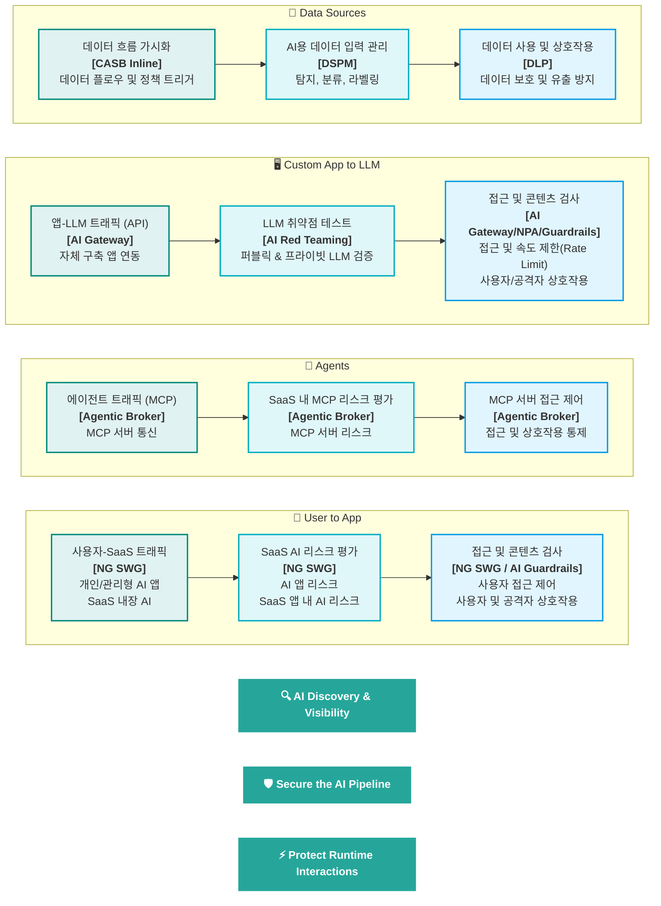

# aisecurity

```mermaid
graph LR
    %% 스타일 정의
    classDef phase1 fill:#e0f2f1,stroke:#00897b,stroke-width:2px;
    classDef phase2 fill:#e0f7fa,stroke:#00acc1,stroke-width:2px;
    classDef phase3 fill:#e1f5fe,stroke:#039be5,stroke-width:2px;
    classDef title fill:#26a69a,color:#fff,font-weight:bold,stroke:none;

    %% 상단 헤더 역할 (논리적 연결 없음)
    H1[🔍 AI Discovery & Visibility]:::title
    H2[🛡️ Secure the AI Pipeline]:::title
    H3[⚡ Protect Runtime Interactions]:::title

    %% 1. User to App (사용자 -> 앱)
    subgraph User_to_App ["👤 User to App"]
        direction LR
        U1["사용자-SaaS 트래픽<br><b>[NG SWG]</b><br>개인/관리형 AI 앱<br>SaaS 내장 AI"]:::phase1
        U2["SaaS AI 리스크 평가<br><b>[NG SWG]</b><br>AI 앱 리스크<br>SaaS 앱 내 AI 리스크"]:::phase2
        U3["접근 및 콘텐츠 검사<br><b>[NG SWG / AI Guardrails]</b><br>사용자 접근 제어<br>사용자 및 공격자 상호작용"]:::phase3
        
        U1 --> U2 --> U3
    end

    %% 2. Agents (에이전트)
    subgraph Agents ["🤖 Agents"]
        direction LR
        A1["에이전트 트래픽 (MCP)<br><b>[Agentic Broker]</b><br>MCP 서버 통신"]:::phase1
        A2["SaaS 내 MCP 리스크 평가<br><b>[Agentic Broker]</b><br>MCP 서버 리스크"]:::phase2
        A3["MCP 서버 접근 제어<br><b>[Agentic Broker]</b><br>접근 및 상호작용 통제"]:::phase3
        
        A1 --> A2 --> A3
    end

    %% 3. Custom App to LLM (자체 앱 -> LLM)
    subgraph Custom_App_to_LLM ["🖥️ Custom App to LLM"]
        direction LR
        C1["앱-LLM 트래픽 (API)<br><b>[AI Gateway]</b><br>자체 구축 앱 연동"]:::phase1
        C2["LLM 취약점 테스트<br><b>[AI Red Teaming]</b><br>퍼블릭 & 프라이빗 LLM 검증"]:::phase2
        C3["접근 및 콘텐츠 검사<br><b>[AI Gateway/NPA/Guardrails]</b><br>접근 및 속도 제한(Rate Limit)<br>사용자/공격자 상호작용"]:::phase3
        
        C1 --> C2 --> C3
    end

    %% 4. Data Sources (데이터 소스)
    subgraph Data_Sources ["💾 Data Sources"]
        direction LR
        D1["데이터 흐름 가시화<br><b>[CASB Inline]</b><br>데이터 플로우 및 정책 트리거"]:::phase1
        D2["AI용 데이터 입력 관리<br><b>[DSPM]</b><br>탐지, 분류, 라벨링"]:::phase2
        D3["데이터 사용 및 상호작용<br><b>[DLP]</b><br>데이터 보호 및 유출 방지"]:::phase3
        
        D1 --> D2 --> D3
    end
```
